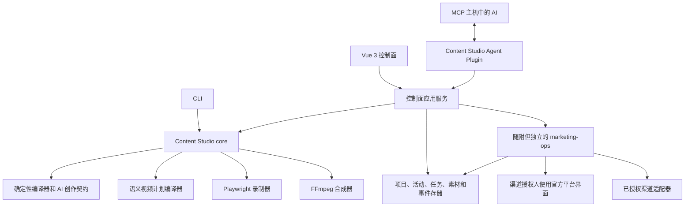

# 架构

> 状态：演进中
> 最近评审：2026-08-04

## AI 原生控制面



Content Studio 的目标不是让 Vue 页面自己调用各种生成 API，而是把项目事实、
发布活动、AI 创作、任务执行和结果观察封装为稳定的应用服务与 MCP 能力。

- AI 负责策划、创作、渠道适配、根据审核修改和数据复盘；
- Vue 工作台负责可视化、编辑、审核、取消、重试和人工接管；
- core 负责验证、版本化、确定性编译和领域规则；
- 运行时适配器负责录制、合成、AI 后台执行等长任务；
- `marketing-ops` 独立负责真实渠道授权、外部写入和发布回执。

当前 V0.1 确定性编译器和 V0.2 录制器是已经落地的基础。V0.3 的第一条本地运行时
切片已经提供 `content-studio serve` 和项目/活动 API，Vue 工作台可以创建并读取
发布活动；MCP AI 创作契约、任务写入和后台 AI 执行器仍按路线图接入，文档不把计划
能力描述成当前已经实现。

## 所有权边界

Content Studio 拥有：

- 版本化项目事实、项目渠道选择、项目渠道账号绑定和发布活动输入；
- 项目素材、活动产物、渠道内容修订和资源变体；
- AI 创作结果的版本、事实引用和安全生成摘要；
- 本地制作任务、进度事件、预览和媒体回执；
- 发布安排与发送给 `marketing-ops` 的项目范围移交数据；
- 发布回执和监测结果的本地只读投影。

`marketing-ops` 独立拥有：

- 渠道适配器、账号配置和授权隔离范围；
- 外部 campaign 授权和渠道策略；
- 发布、回复、删除、运行时健康和配额；
- 人工辅助发布协调；
- 外部写入回执和授权监测。

这里要区分两个“项目”概念。Content Studio 的项目是产品业务对象，拥有活动、内容、
素材和任务；`marketing-ops` 不应拥有这套业务层级。当前 `marketing-ops` 为了隔离
渠道策略、目标来源和回执，仍使用名为 `Project Profile` 的技术配置，并要求调用携带
`projectId`。这个 `projectId` 只能视为兼容期的运行范围/审计句柄，不能反向成为
Content Studio 项目、活动或素材的事实来源。后续公共契约应逐步改成账号引用和发布
上下文驱动，保留隔离能力但避免把技术配置误解成业务项目。

Content Studio 可以显示 `marketing-ops` 的新鲜状态，但不能从项目配置、AI
生成内容、发布安排或人工接管推断或扩大授权。

## 开源本地运行时

Content Studio 的默认产品形态是开源、本地优先。安装器把用户需要的组件组织成
一个本地运行时，而不是要求用户分别克隆和维护多个仓库：

```text
Content Studio installer
        │
        ├─ Content Studio CLI、core 和应用服务
        ├─ 本地 MCP Server 与 Vue 工作台
        ├─ 本地元数据存储
        ├─ Playwright / FFmpeg Worker
        └─ 固定兼容版本的 marketing-ops
```

本地 MCP 使用 `stdio` 或只绑定 `127.0.0.1` 的无状态 Streamable HTTP。项目数据、素材和制作产物默认不
离开用户设备；首次访问项目必须由用户明确选择范围。本地运行时不得自动扫描项目、
修改项目代码、开放公网端口或配置渠道。

### 本地数据与文件存储

本地运行时本身就是 Content Studio 的后端边界，不需要用户另外部署云端 API 或
数据库服务器。正式运行时采用两层存储：

- 内置 SQLite 保存项目登记、项目快照、发布活动、内容版本、任务、追加式进度
  事件、人工接管、发布回执、监测快照和报告索引；
- 项目 `.content-studio/` 或用户明确指定的窄目录保存图片、视频、音频、字幕、
  预览帧和其他媒体文件，SQLite 只记录文件的受控引用、版本和校验和。

项目任务面板和全局任务面板查询同一份本地任务数据，只改变筛选范围。大型媒体不
直接塞进 SQLite，便于备份、迁移和单独清理。

媒体保留分为“长期素材”“活动产物”和“可重建缓存”三类。当前默认建议保留活动产物
30 天、可重建预览缓存 7 天，回收区文件进入 30 天恢复窗口；长期素材、审核通过的
最终产物和发布回执默认不自动删除。清理预览会返回每个登记文件的保留类别和建议清理
时间，但仍必须由用户明确确认，绝不自动删除。清理只允许作用于 Content Studio 自己
登记的文件，并提供预览、确认、回收区和恢复窗口。当前 Runtime 已提供只读占用统计、
带指纹的清理预览、显式确认、回收区查询和单项恢复。确认只会把活动产物移入
`.content-studio/recycle/`，不删除文件、不处理项目素材，也不扫描未知文件；预览发生
变化时必须重新确认。V0.3.0 的内存 Repository 仍用于纯内存测试；
`SqliteContentStudioRepository` 已提供第一版本地控制数据持久化。

Content Studio Plugin 是 AI 宿主入口，遵循 OpenAI Plugin 包格式
（`.codex-plugin/plugin.json` + `skills/` + `.mcp.json`），只包含 Skills 和 MCP 连接声明，不
复制 core 或发布逻辑。MCP App UI 属于客户端命名空间扩展，不作为可移植组件；
用户只安装这一个 Plugin。

项目注册表只收录用户明确登记的项目。导入不是扫描：`content-studio project import`
（有源）和 `content-studio project init`（无源）只负责起草项目清单，用户确认后才
登记。应用启动时可以通过显式的 `additionalProjects` 清单登记多个项目；运行中的
Runtime 提供显式确认的 `POST /api/v1/registry/projects` 登记端点，工作台“导入项目”
页面和安装器都走同一条登记链。登记端点对同一项目采用快照版本语义：清单内容不变
时幂等返回，内容变化时递增快照版本并更新项目记录，因此重导入不会静默丢弃更新。
`GET /api/v1/projects` 返回轻量的跨项目索引（项目
记录、快照版本、预览就绪、活动/任务数量和已启用渠道），工作台用它做总览和项目切换；
读取索引不会扫描项目目录，也不会把不透明账号引用或凭据暴露给全局页面。全局总览和
全局任务面板另读 `GET /api/v1/global`，它只返回显式项目的
活动、执行任务、事件和脱敏项目渠道绑定，并为每条投影保留 `projectId`；取消、重试和
录制命令仍回到项目范围接口。需要报告、完整素材或其他项目业务数据时，仍必须进入
对应项目读取 `GET /api/v1/projects/:projectId`。

工作台的活动详情和全局任务深链接也必须保留项目作用域：活动详情使用
`/project/:projectId/activities/:activityId`，全局任务查询在 `task` 之外写入
`taskProject`。这样即使不同项目存在同名活动或重复任务 ID，刷新页面、复制链接和
从全局列表打开详情也不会把数据投影到错误项目；旧的无项目活动详情路径仅作为默认
项目兼容入口，不作为跨项目链接生成格式。

工作台对项目视图采用明确的三态呈现：本地运行时读取期间只显示加载状态，不渲染演示活动、
任务步骤或视频/发布详情；运行时已连接但返回空集合时显示真实的空状态；运行时不可用时才
回退到只读演示，并在页面上持续标注。活动列表、项目任务面板和活动详情必须共享同一项目
视图投影，不能在页面内部另造一份业务数据。

### `marketing-ops` 受管依赖

`marketing-ops` 随 Content Studio 安装和做兼容性检查，但保持独立仓库、包、
进程或 MCP 服务、数据存储和发布责任。它不是 Content Studio core 的内部模块。

应用服务通过固定、有类型的客户端边界调用它：

1. Content Studio 先从项目渠道绑定解析明确的 `channelAccountRef`；
2. 写入前获取该账号和渠道的最新健康、策略与授权状态；
3. 只传递 renderer 生成的版本化发布包、窄素材引用和必要的发布上下文；
4. 重试保持活动/发布安排标识和幂等键；
5. 只有匹配且持久化的 `marketing-ops` 发布回执才能更新发布投影；成功回执还必须
   带有来源、签发时间，并在项目绑定账号时匹配不透明账号引用。Content Studio 内置
   的假适配器只生成本地 fixture 回执，不连接真实渠道。

兼容现有 `marketing-ops` 时，客户端仍可能同时传递 `projectId`，用于技术隔离和
回执关联；这不表示 `marketing-ops` 负责创建或管理 Content Studio 项目。目标边界
是：Content Studio 决定“哪个项目的哪个活动要发到哪个渠道、使用哪个账号”，
`marketing-ops` 只读取账号配置并执行已授权的自动或人工辅助发布，然后返回回执和
授权范围内的监测结果。它不生成内容、不管理素材，也不创建制作任务。

安装、启动、健康检查、账号绑定、AI 生成或人工接管都不产生发布授权。渠道配置
只能通过 `marketing-ops` 的本地交互式流程完成，Content Studio、MCP 参数和日志
都不能接触凭据或浏览器会话。

`marketing-ops` 未就绪或渠道尚未配置时，文章、图片和视频制作继续可用；发布与
授权监测能力明确显示为未配置或被阻塞，并保持 fail closed。

## 分层

```text
apps/workbench ───────┐
MCP App adapter ──────┼─→ 控制面应用服务
CLI ──────────────────┘          │
                                ├─ 项目、活动和内容服务
                                ├─ 任务命令与投影
                                ├─ 素材、事件和回执存储
                                └─ marketing-ops 客户端边界
                                           │
                            Content Studio core
                                      │
                      ┌───────────────┼───────────────┐
                      ▼               ▼               ▼
                  AI 执行器      Playwright 录制    FFmpeg 合成
```

依赖方向指向 core。UI 和 MCP 适配器只能调用应用服务，不能成为第二个生成、
录制、合成、监测或发布引擎。

运行时适配器实现窄接口。测试应能在不启动真实浏览器、不调用模型、不连接渠道的
情况下验证取消、重试、状态转换和事件顺序。

## MCP 应用边界

MCP 是 AI 使用 Content Studio 的首要应用边界，而不是未来才考虑的附加传输层。
它应提供：

- 项目、项目事实、素材、活动、渠道内容、任务和报告等只读资源；
- 创建或修订活动与内容、启动或控制任务等结构化工具；
- 长任务进度、预览、失败和人工接管通知；
- 复用相同应用服务的 Vue 可视化控制面。

MCP 工具必须是高层、有类型、有项目范围的操作。它们不能接收任意 Shell、
JavaScript、选择器、本地路径、浏览器配置、cookie、token 或密码。

交互式内容创作由 MCP 主机中的 AI 完成。需要定时或脱离对话持续执行的生成工作，
由显式配置的后台 AI 执行器接手；后台执行器必须写入相同任务事件和产物契约，
不能绕过审核、审计或发布授权。

## MCP 2026-07-28 适配

远程服务首选 MCP `2026-07-28`：

- 通过 `server/discover` 公布版本、身份、工具和扩展能力；
- 每个请求显式携带协议版本与客户端能力；
- 不依赖 `initialize` 握手或 `Mcp-Session-Id`；
- 使用不可猜测的 `projectId`、`activityId`、`taskId` 等业务句柄表达跨调用
  状态；
- 在每次工具调用时重新校验用户、项目和句柄归属；
- `server/discover`、工具与资源列表/读取都返回 `resultType: "complete"`、明确
  `ttlMs` 和项目私有的 `cacheScope`；服务身份位于标准 `_meta` 命名空间。

MCP Tasks 只承担单个长工具调用的通用异步生命周期。Content Studio 内部继续
保存生成、录制、合成、等待人工、发布和监测等细粒度状态，再映射为
`working`、`input_required`、`completed`、`failed` 或 `cancelled`。

新 Tasks 扩展没有 `tasks/list`。全局与项目任务面板继续调用有业务范围的
`list_global_tasks` 和 `list_project_tasks`，不能把 MCP Task 句柄协议当成任务
数据库。

MCP App UI 以版本化 `ui://` resource 交付，通过开放 `ui/*` JSON-RPC bridge
调用工具，作为 OpenAI 客户端命名空间扩展存在，不进入 Agent Plugins 可移植
契约。Vue 控制面按行内卡片、内容审核视图和全屏活动工作台拆分。所有核心工具
在不渲染 UI 时仍必须可用。

新实现不依赖已经弃用的 Roots、Sampling 或 MCP Logging。项目范围通过工具参数
和资源 URI 表达；交互式 AI 来自 MCP 主机；后台 AI 使用宿主任务机制或独立
执行器；日志使用安全应用摘要和 OpenTelemetry。

详细协议、Plugin 打包和审核基线见
[MCP App 与公开上架准备](mcp-app-readiness.md)。

## 公网入口与可选远程拓扑

Algorithm Visualizer 的自有服务器已经证明现有域名、TLS、Nginx、Node.js 和
PM2 基础可用于部署轻量服务。公网服务主要用于公共 Plugin 审核、MCP 入口和 UI
resources；本地自托管不依赖该服务。公共形态优先采用：

```text
Nginx / TLS
    │
    ▼
无状态 MCP API + MCP App UI resources
    │
    ├─ 项目、活动、任务和素材元数据
    └─ 受控任务队列
             │
             ▼
经用户明确连接的本地或独立 Worker
Playwright / FFmpeg / AI / marketing-ops
```

现有服务器资源适合作为轻量 MCP API 试运行环境，不适合同时承载高并发
Playwright、FFmpeg 和后台 AI 制作。API 与媒体 Worker 必须能独立扩容、限流和
失败恢复。

生产服务使用独立非 root 用户、窄目录、进程托管、健康检查、资源限制、备份和
OpenTelemetry。模型与渠道凭据继续由外部部署/授权系统管理，不能进入 MCP 参数、
项目数据、日志或仓库。

公网入口与本地运行时之间的连接协议必须单独威胁建模，不能通过模型提示或工具
参数传递设备身份、连接材料或凭据。完整安装与分发决策见
[开源、本地优先与安装分发](local-first-distribution.md)。

## 全局渠道与项目绑定

渠道目录是全局能力定义，不拥有项目账号选择。Content Studio 当前采用项目内唯一绑定：
`ProjectChannelBinding` 为每个 `(projectId, channelId)` 选择是否启用并绑定一个项目账号。
活动只选择项目已启用的渠道，不在活动中再次选择账号；任务、
发布安排和监测记录通过项目绑定解析账号。

```text
全局渠道定义
  + 项目渠道绑定
  + 项目渠道唯一账号
  + 活动目标渠道（不重复选择账号）
  + marketing-ops 当前策略/授权
  = 本次发布可用能力
```

本地项目设置可以降低自动化程度，不能提升外部权限。渠道健康、策略、授权和发布
状态来自新鲜的 `marketing-ops` 快照或回执。

项目可以绑定多个不同渠道，但同一项目同一渠道只能有一个活动可用账号。账号身份由
`marketing-ops` 的全局账号目录和授权边界管理；Content Studio 只保存不透明的
`channelAccountRef`、脱敏别名和必要的状态投影，不保存密码、token、cookie、浏览器
Profile 或支付信息。一个渠道可以在 `marketing-ops` 中配置多个账号，项目绑定其中
一个，活动只选择渠道。更换账号应生成新的绑定版本；历史发布回执仍保留当时使用的
账号引用，不能被后来的项目配置改写。

现有 19 渠道清单及 `automatic-candidate`、`owner-assisted`、
`content-only` 分类仍是 Content Studio 的静态能力元数据，不代表实际授权。
其中 `content-only` 只进入内容生成目录，不属于发布助手，也不应创建发布计划；发布助手
只处理 `automatic-candidate` 和 `owner-assisted` 两类，并继续受 `marketing-ops` 当前
账号、授权和策略约束。

## 项目适配方式

项目注册时必须选择接入模式：

1. **有源项目（`source-owned`）。** 项目可以增加关键节点的 `data-testid` 或
   其他稳定语义标注，并注册受信任的窄适配器。目标是由 AI 生成拍摄大纲和录制
   计划，再由 Playwright 确定性执行。
2. **无源项目（`web-assisted`）。** 项目只有线上网页，不能修改源码。AI 观察
   可见页面并生成辅助计划，由浏览器插件或宿主 Computer Use 能力协助录制，必要
   时由用户完成现场步骤。目标是一次性或低频辅助录制，不承诺同等的自动重放。
3. **导入已有产物。** 直接把已有文章、图片、音频或视频登记为版本化素材，跳过
   页面录制。

有源项目优先使用 role、label、text 和可访问名称，`testid` 只标注录制真正依赖
的关键按钮、状态和结果节点，不要求修改所有 DOM。AI 生成的内容脚本、拍摄大纲
和录制计划必须经过项目范围校验；无源模式的浏览器辅助计划还要记录人工介入和
可重复性等级。

无源辅助计划是 AI 与浏览器宿主之间的窄数据边界：只允许无凭据 HTTPS 同源观察、语义
定位和有限的点击/等待/捕获动作，并且必须标记为需要 Owner。内置 Playwright 和后台
Worker 会拒绝 `web-assisted`/`assisted` 上下文；浏览器插件或 Computer Use 的实际
暂停、人工输入和继续执行不属于当前 Runtime。

受信任项目适配器是代码级扩展点，不是 MCP 的任意代码执行入口。它必须：

- 以已注册 adapter ID 选择已知实现；
- 由本地 Runtime 启动配置按 `projectId`、adapter ID 和版本显式注册，并要求
  `ownerApproved: true`；未注册或项目不匹配时 fail closed；
- 使用版本化、可验证的窄参数；
- 不接收任意命令、脚本或环境变量转储；
- 不读取凭据、浏览器 profile 或用户会话；
- 浏览器交互继续使用 role、label、text 或 test-id 等语义定位；
- 对目标项目的代码修改必须由项目所有者明确许可并单独评审。

完整的有源/无源接入决策、任务差异和实施顺序见
[项目接入模式](project-integration-modes.md)。

## 确定性 core

当前编译器：

1. 拒绝疑似敏感字段和非 HTTPS 公开 URL；
2. 验证事实、语言、渠道、目标 origin 和 capture-flow 引用；
3. 从已声明事实生成渠道内容包；
4. 把 capture step 编译为绝对时间线和 viewport；
5. 只向明确的窄目录写入已知 bundle 文件。

确定性 bundle 不存储生成时间，因此相同输入产生相同结果。运行任务事件和回执
有时间信息，位于 bundle 之外。

AI 创作层在此基础上增加内容修订和非确定性产物，但必须记录项目/活动输入版本、
事实引用、生成器版本和产物校验和。它不能修改历史产物，也不能把模型生成的陈述
自动升级为项目事实。

## 录制执行边界

录制器只消费编译后的 `VideoPlan`，不接受未编译的选择器或脚本。

每次尝试：

1. 使用计划 viewport 和 reduced-motion 创建隔离浏览器上下文；
2. 在一个明确 origin 下导航到项目相对场景路径；
3. 只解析 role、label、text 或 test-id 定位；
4. 执行已编译的 `wait-for`、click、fill、press、wait 和 capture 动作；
5. 发出有序进度事件和预览帧引用；
6. 拒绝弹窗、下载、认证路径和跨 origin 导航；
7. 关闭上下文、保留尝试证据并返回录制器回执。

`AbortSignal` 停止后续工作并中断支持取消的等待。重试创建新的隔离尝试，使用新
尝试编号，并且永不覆盖以前的 `attempt-<n>/` 目录。

### 录制器配置与分辨率

当前 `VideoPlan.recordingConfig` 由活动视频格式编译得到，Playwright 使用其中的
`viewport` 设置目标网站 CSS viewport；页面达到首个语义就绪点后，若后续有状态变更动作，
则完成该动作后再启动场景 screencast，否则在就绪探针完成后启动。这样可避免
把导航白帧或待处理提示带进片段和转场。`outputSize` 在后续合成阶段统一缩放，并应用
`deviceScaleFactor`、`locale` 和 `colorScheme`。默认预设为横屏 1920×1080、
竖屏 1080×1920、方形 1080×1080；活动视频计划也可以指定经过边长、像素总量、比例和
画幅方向校验的自定义宽高。

本地 Runtime 通过活动创建和活动修订接口接收这组白名单字段。修订使用活动版本号做
乐观并发校验，改动视频计划后自动把 `videoPlanReviewStatus` 设回 `pending`，所以旧的
确认不会误用于新的录制尺寸。工作台只是调用这些接口，不在浏览器端复制校验或执行器。

配置按“内置预设 → 项目 `videoRecordingDefaults` → 活动
`video.recordingProfile.defaults` → 渠道 `channelVariants`”合并。项目默认值、活动拍摄计划和渠道资源变体负责声明经过校验的
viewport/输出尺寸，任务执行只读取最终版本化配置。需要
区分网站 viewport（页面布局和响应式断点看到的 CSS 像素）与最终媒体尺寸（文件像素）；
device scale factor、语言和色彩环境也要作为可审计配置，而不是隐藏在浏览器启动参数中。

配置合并只能覆盖白名单字段（viewport、outputSize、deviceScaleFactor、locale、
colorScheme），并校验正整数、最大边长、总像素、宽高比例和项目能力。
禁止通过配置注入任意浏览器参数、脚本、选择器、cookie、凭据、User-Agent 欺骗或浏览器
Profile。帧率、编码码率、裁切、转场和响度交给后续 FFmpeg 合成阶段。最终生效的录制
最终完整配置会写入编译后的 `VideoPlan.recordingConfig` 和每次录制回执，重试不能
悄悄改变录制尺寸或浏览器环境。

## 内容、素材和任务

发布活动先保存主题、目标和目标渠道，再按渠道规格规划内容。文章、视频和图文是
渠道成品类型；图片、封面、字幕、配音、背景音乐、脚本、视频片段和预览帧属于活动
素材或中间产物。渠道成品引用这些素材并携带标题、正文、媒体、资源变体和渠道元数据，
可以直接进入发布安排。

素材只有两个当前作用域：

- 项目素材：可在本项目多个活动间复用；
- 活动产物：为一次活动生成，显式操作后才能沉淀为项目素材。

移动端、PC 端和不同比例文件是渠道内容的资源变体。平台规格决定实际生成集合。

任务只有制作、发布、监测三类。全局和项目任务面板查询同一任务存储，只改变
投影范围。活动页面展示内容、发布和数据等业务对象，不复制任务模型。

### 统一素材预览边界

素材预览统一由应用服务提供，不由 Vue 页面直接拼接本地路径。应用服务只能根据已登记
的项目素材、活动产物或录制回执解析文件引用，并在返回前校验项目、记录 ID、版本和
文件归属。预览响应应根据登记的素材类型返回安全的媒体类型：

```text
文章 / 脚本 / 字幕  → 纯文本或 Markdown 阅读器
图片 / 封面 / 预览帧 → img 缩略图和放大查看
视频 / 片段         → video controls 播放器
音频 / 旁白 / 配乐   → audio controls 播放器
```

预览接口必须同时保留下载入口、校验和、版本和文件缺失状态；禁止接受任意绝对路径、
任意相对路径或未经登记的文件名。当前首版已经接入活动产物和项目素材的预览接口，文件
只从配置的本地 production output root 读取，并在遇到缺失文件时返回明确的 404；录制回执
预览帧继续沿用任务、尝试和产物四级接口。Runtime 另提供只读清理预览，只统计已登记的
项目素材和活动产物；清理确认、回收区和恢复已经接入 Runtime，尺寸、时长和恢复窗口到期
处理仍由后续存储切片补齐。

## 人工接管

人工接管包含活动/渠道/发布安排引用、产物校验和、审核清单和官方目标地址。
它不包含会话、凭据、cookie、浏览器 profile 或绕过平台控制的说明。

渠道授权人在官方渠道界面执行登录、2FA/CAPTCHA、审核和最终发布点击。只有
随后的匹配 `marketing-ops` 回执才能让控制面显示“已发布”。

“渠道授权人”与项目负责人、内容审核人是不同角色。内部兼容名可以保留
`Owner`，面向用户统一使用中文。

## 发布监测

发布和监测都以每个渠道发布记录为单位：

```text
发布安排
  → 发布回执和公开地址
    → 监测计划
      → 定时数据快照
        → 活动/项目报告
```

数据可以来自公开信息、授权适配器或渠道授权人的明确录入。不可用指标使用
`null`，不能伪造为零。Content Studio 只显示和分析结果；本仓库不执行发布、
回复、删除、私有后台抓取或未经匹配授权的其他渠道操作。

详细领域契约和状态机见[控制面模型](control-plane.md)，完整页面层级见
[产品功能模块](product-modules.md)。
