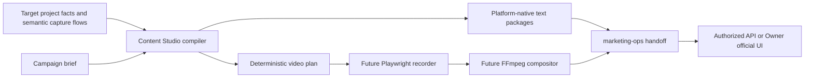

# Architecture

## Boundary

Content Studio owns content and media production. `marketing-ops` owns project registration, channel policy, authorization, receipts, monitoring, replies, and deletion.

## Project adapter

A project manifest is the reusable adapter:

- `facts` are the only source claims available to deterministic content generation;
- `tagline` and `topic` provide localized positioning;
- `captureFlows` describe reproducible interactions;
- `startPath` is project-relative;
- locators are semantic (`role`, `label`, `text`, `test-id`).

There is no arbitrary JavaScript, shell command, CSS/XPath selector, credential field, or browser profile in the contract.

If a new project already has stable accessibility names or test IDs, it needs only a manifest. If an interaction cannot be selected or reset deterministically, the target project may need a small accessibility/testability change. The recorder and compositor stay generic.

## Deterministic core

The compiler:

1. rejects sensitive-looking fields and non-HTTPS public URLs;
2. validates facts, locale, channel, target origin, and capture-flow references;
3. generates channel packages from current declared facts;
4. compiles capture steps into an absolute timeline and viewport;
5. writes only known bundle files to an explicit narrow directory.

No generation timestamp is stored, so identical inputs produce identical bundles.

## Channel delivery classes

- `automatic-candidate`: GitHub, Bluesky, DEV, Mastodon. This is capability metadata, not authorization.
- `owner-assisted`: Weibo, X, Zhihu, Juejin, Jianshu, V2EX, Hacker News, Product Hunt, Facebook, Bilibili, YouTube, Douyin.
- `content-only`: Reddit, Xiaohongshu, WeChat. Content can be prepared, but no current delivery handoff is implied.

The classification follows the current zero-new-cost and no-enterprise-entity constraints. `marketing-ops` remains the final source of truth for runtime channel health and permission.
