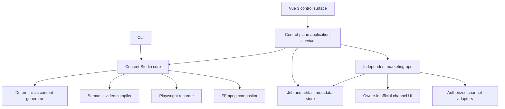

# Architecture

## Control-plane boundary



The Vue application is a replaceable control surface. It renders projects,
campaigns, artifacts, job events, preview frames, Owner handoffs, receipts, and
reports. It does not implement generation, browser recording, composition,
authorization, or channel-specific publishing.

Content Studio owns:

- versioned project and campaign inputs;
- deterministic content and semantic video-plan compilation;
- local recording and composition jobs;
- local artifact metadata, progress events, and media receipts;
- preparation of a project-scoped `marketing-ops` handoff.

`marketing-ops` independently owns:

- registered-project identity and canonical channel configuration;
- campaign authorization and channel policy;
- publishing, replies, deletion, runtime adapter health, and quotas;
- owner-assisted handoff coordination;
- external-write receipts and publication monitoring.

Content Studio may display `marketing-ops` state, but it does not infer or expand
authorization from local project data.

## Layering

```text
apps/workbench (future Vue 3)
        │
        ▼
control-plane application services
        │
        ├── core generation and validation
        ├── recording job runner ── Playwright adapter
        ├── composition job runner ─ FFmpeg adapter
        ├── artifact/event stores
        └── marketing-ops client boundary
```

The dependency direction points inward. Runtime adapters implement narrow core
interfaces. Tests can exercise cancellation, retry, state transitions, and
event order without launching a browser or contacting a channel.

## Project adapter

A project manifest is the reusable content and capture adapter:

- `facts` are the only source claims available to deterministic content generation;
- `tagline` and `topic` provide localized positioning;
- `captureFlows` describe reproducible interactions;
- `startPath` is project-relative;
- locators are semantic (`role`, `label`, `text`, `test-id`).

V0.2 adds an explicit project-owned preview adapter. It may start a known local
preview command through a fixed implementation or attach to a caller-supplied
base URL. The public contract does not accept arbitrary shell, JavaScript,
selectors, environment dumps, credentials, or browser profiles.

If a new project already has stable accessibility names or test IDs, it needs
only a manifest and preview configuration. If an interaction cannot be selected
or reset deterministically, the target project may need a small
accessibility/testability change. The recorder and compositor stay generic.

## Deterministic core

The compiler:

1. rejects sensitive-looking fields and non-HTTPS public URLs;
2. validates facts, locale, channel, target origin, and capture-flow references;
3. generates channel packages from current declared facts;
4. compiles capture steps into an absolute timeline and viewport;
5. writes only known bundle files to an explicit narrow directory.

No generation timestamp is stored, so identical inputs produce identical
bundles. Runtime job events and receipts are intentionally time-bearing and live
outside the deterministic bundle.

## Recorder execution boundary

The recorder consumes a compiled `VideoPlan`; it never accepts uncompiled
selectors or scripts.

For each attempt it:

1. creates an isolated browser context with the plan viewport and reduced motion;
2. navigates to each project-relative scene path under one explicit origin;
3. resolves only role, label, text, or test-id locators;
4. performs the compiled click, fill, press, wait, and capture actions;
5. emits ordered progress events and preview-frame references;
6. rejects dialogs, downloads, authentication routes, and cross-origin
   navigation;
7. closes the context, preserves attempt evidence, and returns a recorder
   receipt.

An `AbortSignal` stops future work and interrupts abort-aware waits. Retry starts
a fresh isolated attempt, emits its own attempt number, and never overwrites the
previous attempt directory.

## Channel delivery classes

- `automatic-candidate`: GitHub, Bluesky, DEV, Mastodon. This is capability
  metadata, not authorization.
- `owner-assisted`: Weibo, X, Zhihu, Juejin, Jianshu, V2EX, Hacker News,
  Product Hunt, Facebook, Bilibili, YouTube, Douyin.
- `content-only`: Reddit, Xiaohongshu, WeChat. Content can be prepared, but no
  current delivery handoff is implied.

The classification follows the current zero-new-cost and no-enterprise-entity
constraints. `marketing-ops` remains the final source of truth for runtime
channel health, policy, and permission.

## Owner handoff

An Owner handoff contains a campaign/channel reference, artifact checksums,
review checklist, and official destination URL. It contains no session,
credential, cookie, browser profile, or instruction to bypass platform
controls.

The Owner performs login, 2FA/CAPTCHA, review, and final publish in the official
channel UI. A later `marketing-ops` receipt—not the handoff itself—is the
evidence that permits the control plane to display `published`.

See [control-plane model](control-plane.md) for the aggregate contracts and
state machine.
