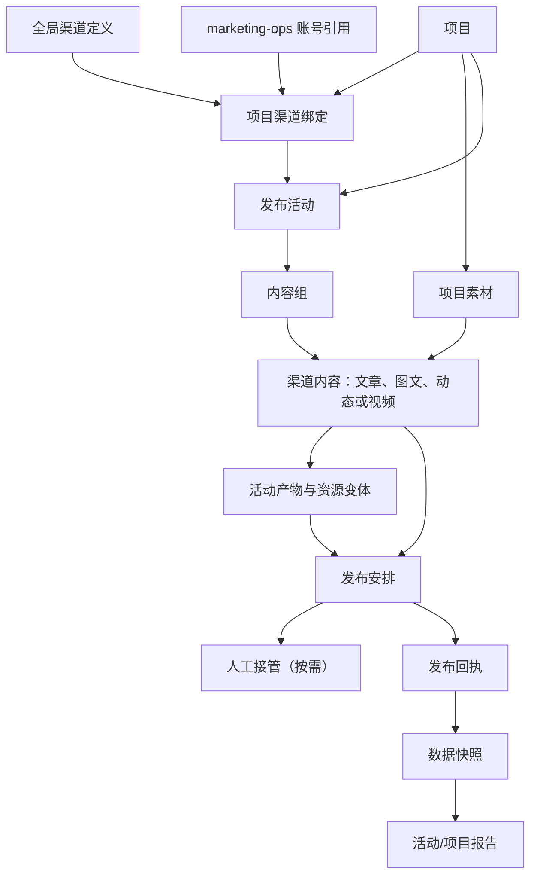
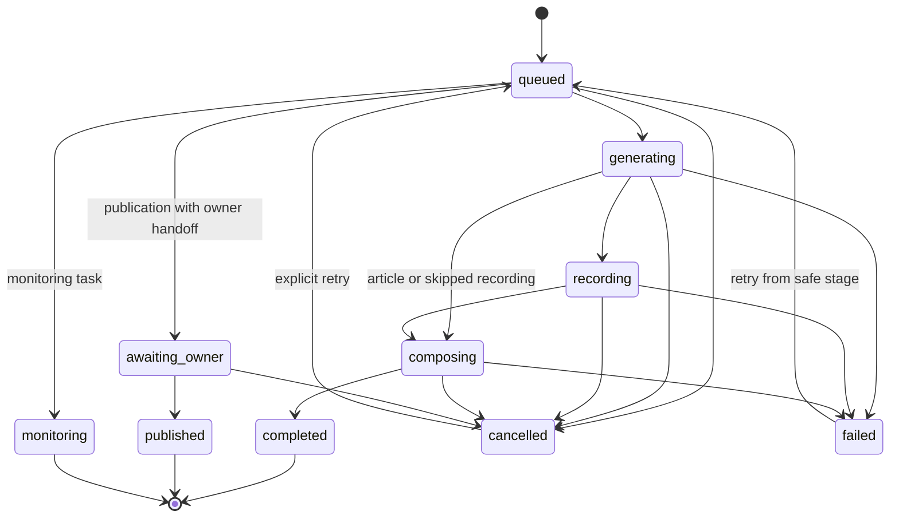

# 控制面模型

> 状态：V0.2 设计基线
> 最近评审：2026-08-09

## 领域归属

项目是 Content Studio 业务数据的主要归属边界。全局层只拥有渠道定义、可用能力
定义和跨项目投影，不拥有项目素材或发布活动。

ID 都是不透明引用。本地素材路径只允许位于明确的 Content Studio 输出根目录。
对外移交媒体时使用校验和与窄范围素材标识，不通过 MCP 传递任意文件路径。

| 模型             | 归属与主要关系                                      | 运行数据                                         |
| ---------------- | --------------------------------------------------- | ------------------------------------------------ |
| 全局渠道定义     | `channelId`、支持的内容类型、资源规格、基础交付类别 | 平台限制、适配器能力定义                         |
| 项目渠道账号引用 | `projectId`、`channelId`、`channelAccountRef`       | 外部账号归属、授权状态和适配器引用               |
| 项目             | `projectId`、项目清单版本、规范来源、预览适配器     | 启用语言、项目状态                               |
| 项目渠道绑定     | `projectId`、`channelId`、`channelAccountRef`       | 是否启用、该渠道唯一项目账号、连接引用、策略快照 |
| 发布活动         | `activityId`、`projectId`、简报版本                 | 业务状态、目标渠道、时间范围                     |
| 内容组           | `contentGroupId`、`activityId`                      | 主题、核心观点、内容顺序                         |
| 渠道内容         | `contentId`、内容组、渠道、文章/视频                | 当前修订、审核状态、生成来源                     |
| 项目素材         | `assetId`、`projectId`、素材版本                    | 校验和、媒体类型、来源和引用                     |
| 活动产物         | `artifactId`、活动/渠道内容、来源素材、语言标记     | 校验和、规格、本地产物引用                       |
| 执行任务         | `taskId`、项目/活动、制作/发布/监测类型             | 状态、尝试、进度、取消请求、事件游标             |
| 人工接管         | `handoffId`、发布安排、产物校验和                   | 检查单、官方地址、失效时间、处理结果             |
| 发布回执         | `receiptId`、发布安排、授权引用                     | 结果、公开地址、外部时间、适配器摘要             |
| 数据快照         | `observationId`、发布回执、采集计划                 | 指标值、采集时间、来源、错误                     |
| 报告             | `reportId`、项目或活动、回执引用                    | 聚合指标、异常和生成版本                         |

当前 V0.1 API 使用 `Campaign` 和 `campaignId`。产品层将其显示为“发布活动”；
在版本化迁移完成前，`activityId` 可以映射到现有 `campaignId`，不能直接破坏
已有清单、CLI 或生成结果。

## 本地运行时与发布依赖

Content Studio 默认以开源本地运行时保存项目、活动、素材、任务和只读投影。
普通用户通过统一安装器获得 Content Studio 服务及固定兼容版本的
`marketing-ops`，不需要安装第二个 Plugin。

`marketing-ops` 仍拥有独立的渠道运行配置、账号目录、策略、授权、外部写入和权威
发布回执。当前实现把这类技术隔离配置称为 Project Profile，并在兼容期要求
`projectId`；它不是 Content Studio 的业务项目，也不拥有活动、内容、素材或制作任务。
两者不共享凭据存储；Content Studio 通过有类型的账号引用/发布包客户端读取新鲜状态、
提交已验证的发布包并接收匹配回执。

依赖安装与能力状态分开表达：

```text
not-installed → installed → healthy → channel-runtime-configured
                                      → channel-ready
```

该状态不是发布流水线的一部分，也不授予权限。即使达到 `channel-ready`，每次
真实写入仍需当前项目、活动、渠道和操作相匹配的明确授权。任一检查不确定时，
发布任务进入阻塞或人工接管，不能推断成功。

## 关系模型



### 全局渠道定义、渠道账号与项目渠道绑定

全局渠道管理描述平台本身，不表达某个项目已经获得发布权限。项目必须显式创建渠道
绑定并为每个启用渠道绑定一个唯一项目账号后，活动才能选择该渠道。一个平台可以有多个
账号，但同一项目不能同时为同一渠道绑定两个活动可用账号。活动只保存目标渠道，任务、
发布安排和监测记录通过项目绑定解析账号。账号身份属于 `marketing-ops` 的授权边界，
Content Studio 只保存不透明的 `channelAccountRef`、脱敏别名和新鲜状态投影。账号密码、
token、cookie、浏览器 Profile 和支付信息不进入 Content Studio、MCP 参数或日志。

一个活动对渠道的实际能力取以下交集：

```text
全局渠道定义
∩ 项目渠道绑定
∩ 活动目标
∩ marketing-ops 当前策略和授权
```

项目可以把全局声明的自动候选能力降级为人工辅助或仅生成内容，但不能在本地把
不允许的渠道升级为自动发布。连接绑定只保存不透明账号引用和健康状态，不保存
token、cookie、密码或浏览器配置。发布回执、监测快照和人工接管必须带上解析后的账号
引用，避免把同一平台的不同账号混为一谈。

### 项目

项目指向经过验证的 `ProjectManifest` 快照。新的清单版本产生新的不可变快照；
已有活动保留创建时使用的版本。项目拥有：

- 事实、定位、内容规则和来源；
- 已启用渠道及项目级默认值；
- 文章和视频的制作方式；
- 可跨项目内活动复用的项目素材；
- 发布活动和项目范围任务投影。

### 发布活动

发布活动围绕一次主题、目标或时间窗口组织多个内容组。不同渠道可以有不同标题、
正文、脚本和资源，只要它们服务于同一个活动目标。

活动页面包含内容组、渠道内容、活动产物、发布安排、发布记录和数据表现。它不
把这些业务对象统一命名为“任务”。活动的业务状态为：

```text
draft → planned → active → completed → archived
```

执行流水线状态由相关执行记录计算后投影到活动页面，不直接替代活动业务状态。

活动与任务是两个层次：一个活动可以产生多个制作、发布和监测任务。任务必须保留
`projectId` 和 `activityId`，控制面展示时还要解析出活动名称、内容和渠道，不能只
显示技术 ID。活动列表显示业务状态（草稿、已规划、进行中、已完成、已归档），任务
列表显示执行状态（排队中、生成中、录制中、合成中、等待人工、已发布、监测中）。

### 内容组与渠道内容

内容组表达共同主题和核心观点。一个内容组拥有一个或多个渠道内容：

- 文章：包括标题、大纲、正文、摘要、配图和渠道化表达；
- 视频：包括脚本、分镜、录制计划、字幕稿、旁白稿和封面方案。

渠道内容是面向具体平台和内容形态的完整作品，不是同一母稿的机械复制。一个渠道可以
在同一活动中选择多个形态（例如 Bilibili 的视频稿、图文和动态），每个形态都保存为
独立版本。AI 可以共享事实和活动目标，但必须遵循目标渠道对应形态的格式、语气和长度
约束。

项目视图中的 `channelBlueprints` 会返回每个渠道的逐形态蓝图：`maxTitleLength`、
`maxBodyLength` 和 `media`（允许的 `image`/`video` 类型、`minCount`、可选的
`maxCount`）。这份只读能力描述供 MCP 主机和工作台在创作前选择形态、准备资源；它不
携带账号或凭据，也不授予任何外部写入权限。

项目视图还按 `contentId` 返回 `channelContentReadiness`。判定只读取该渠道内容显式引用、
且归属同一活动的最终 `image`/`video` 产物；录制片段、预览帧、音频和文章版本仍是素材或
中间证据，不会被误算成可发布媒体。视频合成成功后会把成片、封面和 GIF 的 artifact ID
追加到对应渠道内容的新版本。缺少最小数量或超过明确最大数量时，应用服务拒绝创建
`PublicationPlan`，因此也不会创建发布任务。readiness 只证明本地资源完整，不代表账号
健康、渠道策略允许或已经取得外部写入授权。

图片等最终媒体晚于正文生成时，不需要重建渠道内容。应用服务提供版本化媒体修订：调用方
提交 `contentId`、`baseVersion`、`append`/`replace` 和最终媒体 artifact ID；HTTP 入口为
`POST /api/v1/projects/:projectId/channel-contents/:contentId/media`，MCP 工具为
`revise_channel_content_media`。输入只接受同活动的最终 `image`/`video`。`replace` 仅替换
最终媒体引用，保留文章版本、音频、录制片段等其他引用；版本过期、跨活动产物或已建立
`PublicationPlan` 都会被拒绝。

发布安排建立后，应用服务可以只读准备 transport-neutral 的 Marketing Ops 包。HTTP 入口为
`POST /api/v1/projects/:projectId/publication-plans/:publicationId/package-preparation`，
MCP 工具为 `prepare_marketing_ops_package`。调用方只提交项目、发布安排和受限的 renderer
元数据；应用服务从版本化活动记录解析内容、活动产物和项目快照，并从当前启用的项目渠道
绑定解析不透明账号引用。输入不接受账号引用或本地路径，操作不改变任务、不创建授权或
发布回执，也不调用当前 `marketing-ops` v3 写入接口。

### 项目素材、活动产物和资源变体

当前阶段不设置全局素材库。

项目素材包括 Logo、字体、品牌色、产品截图、插图、音视频片段和模板，可被同一
项目内多个活动引用。活动产物包括文章修订、生成图片、封面、录制片段、预览帧、
字幕、音轨和合成视频。

素材在分配校验和后不可变；修改会创建新版本并链接来源。活动产物如需复用，必须
由用户显式沉淀为新的项目素材版本。

移动端、PC 端、横屏、竖屏、方形、分辨率和平台封装格式由资源变体表达。渠道
规格决定需要哪些变体，系统不为所有内容固定生成“移动端 + PC 端”两份文件。

### 素材保留与清理

Content Studio 不把所有图片、视频和音频都永久保留，也不要求用户手动维护每一个
文件。素材按“是否重要、是否可重新生成”分为三类：

| 类型                                                   | 默认策略                                                  | 清理后仍保留                 |
| ------------------------------------------------------ | --------------------------------------------------------- | ---------------------------- |
| 用户显式保存的项目素材、审核通过的最终产物、已发布内容 | 长期保留，只有用户主动删除                                | 版本、来源、校验和、发布回执 |
| 草稿、失败尝试、旧预览帧、旧录制片段和中间产物         | 活动产物默认 30 天、预览缓存默认 7 天，先提醒并由用户确认 | 活动版本、任务事件和失败摘要 |
| 浏览器缓存、FFmpeg 临时文件和其他可重建缓存            | 只有登记后才进入清理预览；当前不自动触碰未知缓存          | 必要的任务结果摘要           |

当前使用上述默认策略，用户自定义期限和后台自动清理仍是后续切片。系统先显示占用空间和
待清理清单，得到确认后将 Content Studio 自己登记的活动产物移入
`.content-studio/recycle/`，保留恢复窗口；
不会扫描或删除项目目录中未知的文件，也不会把项目素材放入待确认清单。Runtime 的
确认请求带有清理预览指纹，预览变化时必须重新读取并确认；回收区提供单项恢复。
自动按期限删除仍未启用，恢复窗口结束后的物理清理策略属于后续存储切片。

### 执行任务

执行任务只有三种顶层类型：

| 类型     | 来源业务对象       | 典型执行                                       |
| -------- | ------------------ | ---------------------------------------------- |
| 制作任务 | 渠道内容或活动产物 | AI 生成、图片生成、录制、合成、字幕、旁白      |
| 发布任务 | 发布安排           | 准备发布包、调用 `marketing-ops`、等待人工接管 |
| 监测任务 | 已发布回执         | 定时采集、重试、指标标准化和报告更新           |

全局任务面板聚合所有项目任务；项目任务面板过滤同一份执行记录。两者都是投影，
不各自存储任务。

每次尝试保留有序进度事件、受限日志摘要、预览和回执。取消只终止当前尝试；
重试创建新尝试并链接此前记录。

一个制作任务内部可以继续细化为步骤，例如视频制作的脚本与拍摄大纲、分镜与录制
计划、浏览器录制、预览帧、合成、字幕、旁白和资源变体。步骤优先作为任务事件和
任务详情中的进度清单保存；只有需要独立调度、取消或重试时才拆成子任务。项目任务
面板和全局任务面板仍然查询同一份顶层执行记录。

### 渠道授权人与人工接管

“渠道授权人”是有权在对应平台账号中执行人工步骤的人，不等于项目负责人或
内容审核人。

人工接管是一个审查包，包含发布安排、产物校验和、检查单、官方目标地址和失效
时间。它不是登录会话，也不包含凭据、cookie 或浏览器配置。渠道授权人在官方
平台界面完成登录、2FA/CAPTCHA、审核、必要修改和最终发布点击。

人工接管不应作为孤立的业务层级理解。它是任务进入 `awaiting-owner` 后的人工处理
步骤；总览和任务面板可以聚合“待人工处理”，活动详情和任务详情负责展示完整上下文。

内部代码可暂时保留 `OwnerHandoff` 和 `awaiting-owner`；产品界面显示“人工
接管”和“等待渠道授权人”。

### 发布回执

录制器和合成器回执描述本地制作结果。发布回执只能来自 `marketing-ops`，必须
包含匹配的项目、活动/外部 campaign 授权、渠道、发布安排和结果。

人工接管本身不能让内容进入“已发布”。只有匹配的成功发布回执才允许控制面显示
已发布状态和公开地址。

### 数据快照与报告

监测绑定具体发布回执和公开地址，不绑定文章生成或视频录制任务。每个发布记录
可以有独立采集计划，例如发布后 1 小时、48 小时、7 天或项目自定义时间点。

标准指标包括：

- 播放量和阅读量；
- 点赞、评论、回复、收藏和分享；
- 可用时的点击量或其他渠道特有指标。

指标值同时记录采集时间和来源。平台未提供的指标为 `null`，不能写成 `0`。
允许的数据来源是公开数据、授权渠道适配器或渠道授权人的明确录入。

报告是不可变素材、发布回执和数据快照的可再生投影，不修改历史回执。Content
Studio 不抓取未授权的私有后台，也不在本仓库执行回复、删除或其他渠道写入。

## AI 创作模型

MCP 主机中的 AI 是主要创作者和流程协调者。Content Studio MCP 暴露固定的
高层能力，使 AI 可以：

- 读取项目事实、素材、活动简报和渠道约束；
- 创建或修订内容组和渠道内容；
- 保存文章、图片方案、视频脚本、分镜、字幕稿和旁白稿版本；
- 启动、取消和重试制作任务；
- 读取进度、预览、回执和监测数据；
- 根据审核意见修改内容并生成活动复盘。

AI 生成记录应保存输入版本、事实引用、产物和生成摘要。它不保存模型的隐式推理
过程，不在 MCP 参数、项目清单或本地产物中接收模型或渠道凭据。

交互式创作由当前 MCP 主机中的 AI 发起。定时和长时间运行的自动创作以后由后台
AI 执行器承接，但它必须调用相同的应用服务、写入相同的事件流，并接受同样的
取消、重试、审计和授权限制。

## 生命周期状态机

状态集合由制作、发布、监测三类执行任务共享，但每条任务只走自己的生命周期：

```text
视频：
queued → generating → recording → composing → completed

文章：
queued → generating → composing → completed

发布：
queued → awaiting-owner → published

监测：
queued → monitoring
```

导入的完成素材可以跳过生成或录制阶段。发布与制作保持独立任务，制作完成不会授予
发布权限；跳过必须记录显式事件，不能伪造已执行阶段。



状态规则：

- 状态变化是追加事件，不是 UI 直接改字段；
- 只有当前任务版本可以转换状态；
- 取消对当前尝试终止，保留已产生的证据；
- 重试增加尝试编号并链接失败或取消的尝试；
- `published` 必须有成功且匹配的 `marketing-ops` 回执；
- `monitoring` 至少绑定一个已发布渠道；
- 多渠道部分成功按发布记录分别表示，再由活动投影汇总。

## 标准任务事件

当前录制器事件契约保持不变：

```ts
interface JobProgressEvent {
  schemaVersion: 1
  jobId: string
  attempt: number
  sequence: number
  stage: 'generating' | 'recording' | 'composing'
  kind:
    | 'attempt-started'
    | 'scene-started'
    | 'action-started'
    | 'preview-ready'
    | 'action-completed'
    | 'scene-completed'
    | 'attempt-completed'
    | 'attempt-failed'
    | 'attempt-cancelled'
  progress: {
    completed: number
    total: number
  }
  message: string
  artifact?: RecorderArtifact
}
```

应用主机持久化事件信封时可以附加运行时间。规范顺序由 `attempt` 和 `sequence`
决定，不依赖时间戳。

后续的 AI 生成、发布和监测执行器复用同一事件信封与尝试模型，但拥有各自明确的
`stage` 和事件 `kind`，不把录制专属事件强行用于其他任务。

## 控制面投影和命令

| 投影         | 最小内容                                              |
| ------------ | ----------------------------------------------------- |
| 项目列表     | 项目/版本、启用渠道账号、预览就绪状态、活动和任务摘要 |
| 发布活动列表 | 业务状态、内容组、目标渠道、发布完成度、下一安全操作  |
| 全局渠道中心 | 内容类型、资源规格、交付类别、健康和平台限制          |
| 项目渠道设置 | 是否启用、账号身份、默认值、连接引用和当前策略阻塞    |
| 项目素材库   | 不可变版本、来源、校验和、活动引用                    |
| 任务面板     | 三类任务、阶段、尝试、进度、预览、日志摘要和安全操作  |
| 人工接管列表 | 失效时间、检查单、官方地址、预期回执和处理结果        |
| 报告时间线   | 按发布回执组织的结果与数据快照                        |

项目列表投影由 Runtime 的 `GET /api/v1/projects` 提供。它只读取已经登记的项目，返回
项目版本、预览就绪状态、活动/任务数量、三类任务计数和已启用渠道；全局页面不能借此
修改项目绑定，也不能把账号引用升级为发布授权。完整内容和事件仍通过项目范围接口
读取。

全局总览和全局任务面板通过只读的 `GET /api/v1/global` 获取跨项目执行视图。这个视图
只由显式登记的项目组成，返回每个项目的活动、任务、任务事件、活动产物、项目素材和
脱敏后的项目渠道绑定；绑定中的不透明 `accountRef` 不会跨到全局响应。工作台用该视图
显示“哪个项目的哪个活动/任务”，但所有取消、重试、录制等命令仍携带明确的
`projectId`，不会因为全局列表而失去项目边界。

因此工作台生成的活动详情链接使用 `/project/:projectId/activities/:activityId`，全局任务
深链接同时保存 `taskProject` 和 `task`。项目 ID 是数据边界，不是可选的展示标签；没有
项目作用域就不能可靠地还原活动、任务事件、素材和回执。

初始应用命令保持高层且有范围限制：

- 注册或验证项目快照；
- 在项目中启用或停用全局渠道；
- 创建或修订发布活动、内容组和渠道内容；
- 生成文章、图片方案、视频脚本和资源变体；
- 启动、取消或重试制作任务；
- 创建发布安排并准备人工接管；
- 刷新 `marketing-ops` 渠道状态；
- 接收匹配发布回执并调度监测；
- 根据回执和数据快照重建报告。

不存在任意 Shell、浏览器脚本、选择器执行、凭据输入、CAPTCHA 处理或无范围渠道
写入命令。

## MCP App 边界

MCP 不是后期附加的可选传输层，而是 AI 使用 Content Studio 的首要应用边界。
它暴露受约束的项目资源、结构化工具、进度通知和可视化控制面。

Vue 工作台可以作为 MCP App 的可视化界面，也可以独立连接同一应用服务。CLI
继续服务于确定性编译、验证和开发流程。三者不能绕开应用服务直接修改素材目录、
任务状态或授权信息。

```text
MCP AI / Vue 工作台 / CLI
            │
            ▼
    控制面应用服务
            │
    ┌───────┼────────┐
    ▼       ▼        ▼
Content  执行任务   投影/素材/事件
Studio   运行时     持久化
core      │
          ├─ Playwright / FFmpeg / AI 执行器
          └─ 独立 marketing-ops 边界
```

MCP 工具只能接受项目和活动范围内的版本化参数，不接受任意路径、脚本、浏览器
配置、cookie 或凭据。

## 录制器回执

录制器回执包含：

- schema 版本、任务/活动/项目 ID、计划校验和和尝试编号；
- 重试时的上一尝试引用；
- 终态（`succeeded`、`failed` 或 `cancelled`）；
- 场景/动作总量与完成量；
- 视频、预览和诊断产物引用及校验和；
- 有界日志数量和安全摘要；
- 失败代码和安全错误信息；
- 之前尝试的链接。

原始控制台文本不会自动持久化。日志摘要在写入前移除含凭据的 URL、疑似敏感
字段值和过大载荷。

## 持久化姿态

V0.2 契约保持存储无关。本地实现可以把任务元数据保存在
`.content-studio/jobs/<job-id>/`，并为每次尝试创建不可变的
`attempt-<n>/` 目录。

工作台和 MCP App 只能消费应用服务 API、资源或事件流，不能遍历任意本地路径。
