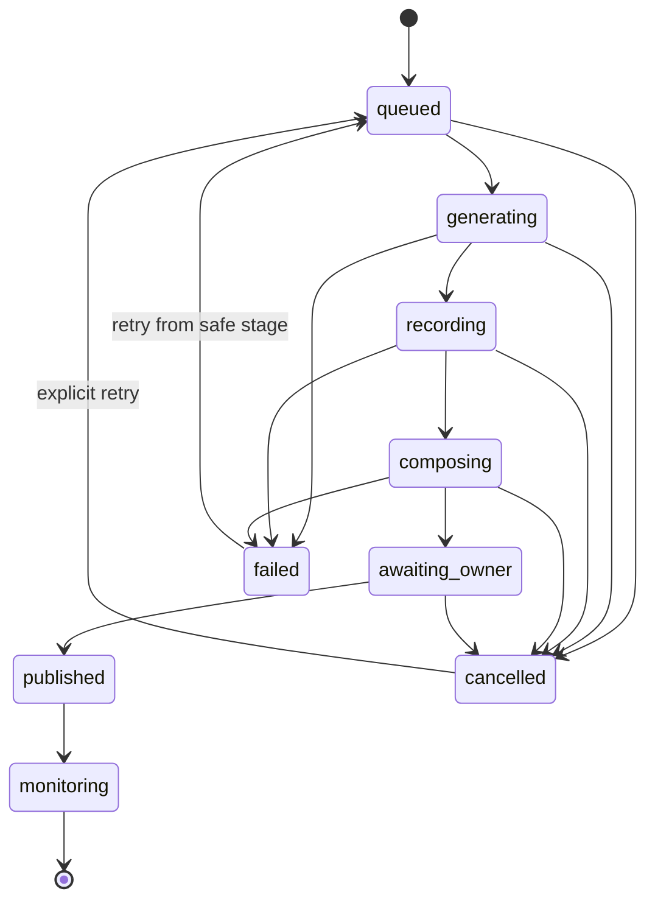

# Control-plane model

> Status: design baseline for V0.2
> Last reviewed: 2026-07-29

## Aggregate model

All records are project-scoped and versioned. IDs are opaque references; local
artifact paths are accepted only inside an explicit Content Studio output root.
External media handoffs use checksums and narrow artifact identifiers rather
than arbitrary filesystem paths.

| Model         | Required identity and relationships                             | Mutable operational data                                     |
| ------------- | --------------------------------------------------------------- | ------------------------------------------------------------ |
| Project       | `projectId`, manifest version, canonical origin, repository URL | enabled locales, preview adapter reference                   |
| Campaign      | `campaignId`, `projectId`, brief version, selected channels     | lifecycle status, current stage, attempt counters            |
| Channel       | `projectId`, channel ID, locale, delivery class                 | capability/policy snapshot from `marketing-ops`              |
| Content asset | asset ID, campaign/channel/locale, generator version            | checksum, media type, size, local artifact reference         |
| Video job     | job ID, campaign ID, immutable plan checksum                    | stage, attempt, progress, cancellation request, event cursor |
| Owner handoff | handoff ID, campaign/channel, artifact checksums                | review checklist, official destination, expiry, disposition  |
| Receipt       | receipt ID, campaign/channel, authorization reference           | outcome, public URL, external timestamp, adapter summary     |
| Report        | report ID, campaign ID, receipt references                      | 1h/48h/7d observations, errors, aggregate metrics            |

These aggregates are not screen-specific view models. The CLI, Vue workspace,
and a future MCP-hosted surface issue the same application commands and consume
projections derived from the same events.

### Project

The Project points to a validated `ProjectManifest` snapshot. A new manifest
version produces a new immutable snapshot; campaigns retain the version they
used. The preview adapter is a known implementation selected by ID, not an
arbitrary command embedded in project data.

### Campaign

The Campaign binds a project snapshot to a brief, content targets, channels, and
optional video plan. It owns the end-to-end control-plane state but does not own
publishing authorization. Authorization is represented only by a reference
returned from `marketing-ops`.

### Channel

The Channel record combines Content Studio's static delivery metadata with a
time-bounded capability and policy snapshot from `marketing-ops`. A stale or
unhealthy snapshot blocks handoff; local configuration cannot override it.

### Content asset

Every generated text, image, audio, subtitle, clip, preview frame, and composed
video is an asset. Assets are immutable after checksum assignment. A revision
creates a new asset linked to its source assets.

### Video job

A Video Job consumes one immutable `VideoPlan`. Recording and composition use
separate attempts so a composition retry does not repeat a successful
recording. Each attempt preserves progress events, a bounded log summary,
preview frames, and a receipt.

### Owner handoff

The handoff is a review packet, not an authenticated browser session. It tells
the Owner what is ready, where the official destination is, and which checks
remain. Login, CAPTCHA/2FA, edits, and the final click remain under Owner
control.

### Receipt

Recorder and compositor receipts describe local work. Publication receipts come
only from `marketing-ops` and include the matching project, campaign,
authorization, channel, outcome, and public result. Receipt payloads never
include credentials or raw browser state.

### Report

Reports are projections over immutable assets and receipts plus monitoring
observations. They can be regenerated; they do not mutate historical receipts.

## Lifecycle state machine



Canonical external names use kebab case:

`queued → generating → recording → composing → awaiting-owner → published → monitoring`

Rules:

- transitions are append-only events, not direct UI mutations;
- only the current job version may transition;
- cancellation is cooperative and terminal for the current attempt;
- a retry increments the attempt and links to the failed/cancelled attempt;
- `published` requires a successful, matching `marketing-ops` receipt;
- `monitoring` requires at least one published channel and records observation
  windows independently;
- partial multi-channel publication is represented per channel and summarized
  by the Campaign projection; it never fabricates a successful receipt.

## Standard job event

Each long-running worker emits:

```ts
interface JobProgressEvent {
  schemaVersion: 1
  jobId: string
  attempt: number
  sequence: number
  stage: 'generating' | 'recording' | 'composing'
  kind:
    | 'attempt-started'
    | 'scene-started'
    | 'action-started'
    | 'preview-ready'
    | 'action-completed'
    | 'attempt-completed'
    | 'attempt-failed'
    | 'attempt-cancelled'
  progress: {
    completed: number
    total: number
  }
  message: string
  artifact?: {
    assetId: string
    kind: 'preview-frame'
  }
}
```

Workers add runtime timestamps at the persistence boundary. Sequence and
attempt, not timestamps, define event order.

## Workspace projections and commands

The control surface consumes narrow projections instead of reading storage
directories:

| Projection        | Minimum contents                                                                  |
| ----------------- | --------------------------------------------------------------------------------- |
| Project portfolio | project/version identity, locales, validation result, preview readiness           |
| Campaign board    | lifecycle stage, selected channels, asset/job counts, next safe action            |
| Channel center    | delivery class, snapshot age, runtime health, policy blockers, Owner action       |
| Content library   | immutable revisions, locale/channel fit, checksums, approval disposition          |
| Video job detail  | stage, attempt history, ordered progress, preview frames, bounded logs, artifacts |
| Owner inbox       | handoff expiry, checklist, official destination, expected receipt, disposition    |
| Report timeline   | receipt-backed outcomes and 1h/48h/7d observation windows                         |

Initial application commands are intentionally high-level:

- register or validate a project snapshot;
- create or revise a campaign;
- generate content and video-plan assets;
- start, cancel, or retry a recording/composition job;
- prepare an Owner handoff;
- refresh `marketing-ops` channel state;
- ingest a matching receipt and regenerate reports.

There is no command for arbitrary shell, browser automation, selector execution,
credential entry, CAPTCHA handling, or unscoped channel writes.

## MCP-style application boundary

Content Studio may later expose its projections, commands, and progress events
through an MCP application surface. That transport is an adapter, not the
domain boundary. A local Vue application service remains the first control
surface so Playwright, FFmpeg, local artifact access, cancellation, and
streaming previews have an explicit process owner.

An MCP adapter must expose fixed high-level operations with project and campaign
scope. It cannot accept arbitrary browser instructions, file paths, shell
commands, cookies, or credentials. External publishing still flows through the
independent `marketing-ops` contract and its matching authorization.

## Recorder receipt

A recorder receipt is machine-readable and contains:

- schema version, job/campaign/project IDs, plan checksum, and attempt;
- terminal outcome (`succeeded`, `failed`, or `cancelled`);
- scene/action totals and completed counts;
- video, preview, and diagnostic artifact references with checksums;
- bounded log counts and sanitized summaries;
- failure code and safe message when unsuccessful;
- links to prior attempts.

Raw console text is not automatically persisted. Log summarization removes
URLs containing credentials, sensitive-looking field values, and excessive
payloads before writing a bounded report.

## Persistence and API posture

V0.2 keeps the contracts storage-agnostic. A local file implementation may
store job metadata under `.content-studio/jobs/<job-id>/`, with immutable
`attempt-<n>/` directories. The future workspace should consume application
service APIs or an event stream and never traverse arbitrary local paths.
