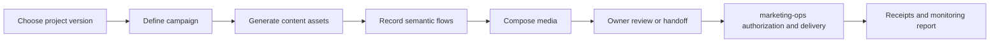

# Product vision

> Status: active
> Last reviewed: 2026-07-29

## Direction

Content Studio will become a cross-project content-production and publishing
control plane. Algorithm Visualizer is the first proving project, not a
project-specific product boundary.

The system should let an Owner select a versioned project and campaign, generate
channel-native content automatically, observe video production, review final
assets, complete owner-only channel steps, and follow publication results from a
single workspace.

It should feel like a local-first MCP-style application: the workspace exposes
high-level project, content, job, artifact, handoff, receipt, and report
operations while reusable services do the actual work. The product must not
depend on one MCP host or browser surface; the CLI, Vue workspace, and future
embedded clients remain interchangeable consumers of the same contracts.

## Product principles

1. **Automation by default.** Declared project facts and campaign intent should
   produce deterministic content, video plans, and reproducible artifacts
   without repetitive authoring.
2. **One reusable core.** The CLI, future Vue workspace, and integrations call
   the same Content Studio core contracts. UI state never becomes a second
   content or recording engine.
3. **Observable long-running work.** Every job emits standard progress events,
   concise log summaries, preview frames, and a machine-readable receipt.
4. **Safe interruption.** Recording and composition are cancellable and
   retryable. Retry creates another attempt with preserved evidence instead of
   hiding the previous failure.
5. **Explicit authority.** A package, preview, or Owner handoff never grants
   publishing authority. `marketing-ops` remains independently responsible for
   authorization, channel policy, external writes, receipts, and monitoring.
6. **Owner control at platform boundaries.** On owner-assisted channels the
   Owner uses the official platform UI for login, 2FA/CAPTCHA, review, and the
   final publish click. Content Studio coordinates the handoff but neither owns
   nor automates the authenticated session.
7. **Portable project adapters.** Projects contribute versioned facts,
   canonical origins, and semantic capture flows. They do not contribute
   arbitrary scripts, selectors, or recorder forks.

## Workspace experience

The long-term workspace has seven connected areas:

| Area        | Owner outcome                                                                                                                      | Source of truth                                                     |
| ----------- | ---------------------------------------------------------------------------------------------------------------------------------- | ------------------------------------------------------------------- |
| Projects    | Register and switch among products, versions, locales, facts, preview adapters, and capture flows                                  | Versioned Content Studio project snapshots                          |
| Campaigns   | Define an intent once, choose audiences/channels, and follow the complete lifecycle                                                | Content Studio campaign aggregate                                   |
| Content     | Generate, compare, revise, and approve platform-native text, metadata, covers, captions, and narration scripts                     | Immutable content assets and revisions                              |
| Channels    | See the supported platform inventory, delivery class, current health, policy, and required Owner action                            | Static Content Studio metadata plus fresh `marketing-ops` snapshots |
| Video       | Watch scenes and actions advance, inspect preview frames, cancel/retry attempts, and compare landscape/portrait/square output      | Recorder/compositor jobs, events, artifacts, and receipts           |
| Owner inbox | Handle official-UI login, 2FA/CAPTCHA, review, final click, and public-URL confirmation without exposing the authenticated session | Expiring handoff packets and matching `marketing-ops` receipts      |
| Reports     | Review publication outcomes, 1h/48h/7d observations, FAQ candidates, Bug routing, failures, and audit history                      | Receipts and regenerable report projections                         |

The first UI does not need every area at full depth. Its minimum useful slice is
Projects, Campaigns, Video Job Detail, and Owner Inbox backed by real
application-service contracts rather than mock-only UI state.

## Interaction posture

- The workspace may preview generated content and media before any publishing
  authorization exists.
- Project and campaign editing creates versioned snapshots; it never silently
  rewrites the inputs used by an existing artifact or receipt.
- Long-running work is driven by commands (`generate`, `record`, `compose`,
  `cancel`, `retry`) and observed through ordered events and read models.
- Channel management means selecting targets and displaying
  `marketing-ops`-owned capability/policy state. It does not mean collecting
  credentials or directly controlling authenticated browser sessions.
- Owner-assisted work pauses at a clear handoff boundary and resumes only from
  a matching receipt or explicit Owner disposition.
- Raw logs and arbitrary local paths are not a product interface. The UI
  receives bounded summaries, typed failures, preview/artifact references, and
  safe actions.

## Primary workflow

The control plane projects that workflow as:

`queued → generating → recording → composing → awaiting-owner → published → monitoring`

Cancellation and failure are explicit side states. Retry returns a failed or
cancelled job to its last safe restart point and increments its attempt number.

## Success criteria

- Adding a project normally requires data, stable semantic locators, and a
  project-owned preview adapter—not changes to recorder internals.
- A user can understand what a media job is doing without opening raw logs.
- Cancellation stops new actions promptly and leaves existing evidence intact.
- A retry is traceable to its prior attempt.
- Every published channel result can be traced to a matching campaign
  authorization and receipt outside Content Studio.
- The Vue workspace can be replaced without changing core production behavior.
- One workspace can manage multiple unrelated projects without project-specific
  recorder forks or shared mutable campaign state.
- Channel and Owner-action views remain useful when automatic publishing is
  unavailable, because content production and official-UI handoff still stay
  automated and traceable.
