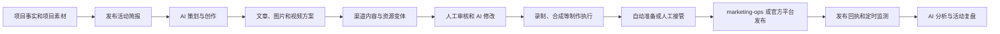

# 产品愿景

> 状态：生效
> 最近评审：2026-08-02

## 定位

Content Studio 将成为一个开源、本地优先、跨项目、AI 原生的内容生产与发布
控制台。Algorithm Visualizer 是第一个端到端验证项目，不是产品边界。

Content Studio 的首要形态是 MCP App：AI 是主要创作者和流程协调者，能够读取
项目事实与发布活动简报，生成文章、图片、视频脚本和渠道版本，并调用受约束的
工具保存版本、启动制作流程、观察进度、响应审核意见和分析发布结果。

Vue 工作台是同一套能力的可视化控制面，用于浏览、编辑、审核、取消、重试和
人工接管。它不复制 AI 创作、录制、合成或发布逻辑。CLI、MCP App 和 Vue
工作台必须复用同一组 Content Studio core、任务、素材和回执契约。

真实渠道发布仍属于独立的 `marketing-ops`。Content Studio 可以自动完成内容
生产并准备发布，但生成结果永远不会自动授予渠道写入权限。

## 公开分发目标

Content Studio 以进入 ChatGPT 与 Codex 共用的公共 Plugins Directory 为明确
发布目标，并按首批上架应用的标准准备产品、协议、部署、审核用例和公共材料。

面向 OpenAI 生态时，分发包遵循 OpenAI Plugin 目录约定：
`.codex-plugin/plugin.json` + `skills/` + `.mcp.json` 组成 ChatGPT/Codex
内核。其他 MCP 客户端是否能复用 Skills 或 MCP 配置取决于各自实现，不能由本包
结构保证。MCP App UI 不在可移植契约内，作为客户端
命名空间扩展（如 `com.openai.*`）交付；Skills 和无状态 MCP Server 才是可移植
组件。Content Studio 将以 Agent Plugin 包形式分发，而不是把一个独立后台简单
嵌入聊天窗口。

远程 MCP Server 首选 `2026-07-28` 协议和正式的 MCP Apps/Tasks 扩展。协议层
保持无状态，项目、活动、内容、素材和任务状态通过显式 ID 与服务端持久化管理。
完整目标和上架准备见[MCP App 与公开上架准备](mcp-app-readiness.md)。

## 开源与本地优先

Content Studio 默认使用用户自己的设备或自托管环境保存项目事实、素材、活动
产物、任务证据和发布运行状态，并在本地执行 Playwright、FFmpeg 和项目适配器。
用户不需要购买 Content Studio 托管服务才能使用完整的个人工作流。

面向普通用户的目标安装流程是“一条命令安装本地运行时、一次安装 Content
Studio Plugin、第一次使用时确认项目目录和能力”。面向源码开发者继续使用 pnpm
构建和验证。

`marketing-ops` 默认作为受管运行时依赖随 Content Studio 安装，用户不需要再
安装第二个 Plugin。它仍保持独立仓库、版本、进程或 MCP 服务、存储和权限边界；
一起安装不代表配置渠道，更不代表获得发布授权。

公共 Plugins Directory 要求公网生产 MCP URL，因此市场版本保留一个轻量无状态
入口和 UI resources。项目数据、浏览器和媒体制作默认仍在本地；托管 Worker、
团队同步和跨设备协作是以后可以选择的增强能力，不是开源本地版的运行前提。

完整分发和安装边界见
[开源、本地优先与安装分发](local-first-distribution.md)。

## 产品原则

1. **AI 是主要创作者。** 文章、图片方案与图片、视频脚本、分镜、字幕稿、
   旁白稿和渠道化版本都应能够由 AI 生成和迭代。
2. **项目是数据归属边界。** 项目拥有事实、启用渠道、制作方式、素材、发布
   活动和执行记录。全局页面只管理公共定义或聚合项目投影。
3. **渠道和账号全局管理、项目选择唯一账号。** 全局渠道目录描述平台能力、限制和
   可用账号；一个渠道可以配置多个账号，并显示每个账号被多少个项目引用。项目为每个
   渠道选择一个全局账号，或不选择以表示不使用该渠道。发布活动只选择项目已启用的
   渠道，任务和发布流程自动解析项目账号。
4. **素材默认归项目。** Logo、品牌资源和模板属于具体项目；活动产物属于具体
   活动。当前阶段不建立缺少明确共享边界的全局素材库。
5. **活动表达业务，任务表达执行。** 一次发布活动围绕同一主题组织不同平台的
   不同内容。活动内使用内容组、渠道内容、资源变体、发布安排、发布记录和数据
   表现，不把这些业务对象全部叫作任务。
6. **文章和视频是两类发布内容。** 图片是可以由 AI 独立生成的素材，通常作为
   文章配图、视频画面或封面使用。
7. **资源规格由渠道决定。** 移动端、PC 端、横屏、竖屏、方形和不同分辨率是
   资源变体，不假设所有渠道都机械地产生两套文件。
8. **长任务必须可观察。** 制作、发布和监测任务提供标准进度事件、日志摘要、
   预览、尝试记录和机器可读回执。
9. **取消和重试必须可追溯。** 取消是协作式的；重试创建新的尝试并保留此前
   证据，不覆盖失败历史。
10. **发布权限必须独立验证。** 内容包、预览和人工接管都不产生发布授权。
    `marketing-ops` 仍负责授权、渠道策略、外部写入和发布回执。
11. **人在平台边界保留控制。** 需要登录、验证码、平台审核或最终点击时，
    系统暂停并交给渠道授权人在官方平台界面完成。
12. **扩展必须是窄接口。** 项目可以在得到所有者许可后实现受信任的项目内
    适配代码，但 MCP 和公共契约不接受任意脚本、Shell、选择器或凭据。
13. **协议无状态、业务状态显式。** MCP transport 不依赖协议 session；所有
    跨调用状态都通过项目范围的不可猜测句柄、持久化记录和授权校验表达。
14. **Headless 是基础，UI 是增强。** 没有 MCP App UI 时工具仍能完成工作流；
    UI 只在检查、比较、编辑、确认、预览和监测时提供更高效的交互。
15. **开源本地版是完整产品。** 云端只提供公共入口或用户主动选择的托管增强；
    本地运行时拥有完整 core、控制面、制作 Worker 和受管发布依赖。
16. **安装依赖不继承权限。** `marketing-ops` 可以随 Content Studio 自动交付
    和升级，但渠道配置、活动授权和外部写入仍由其独立校验并 fail closed。

## 核心业务关系

```text
全局渠道目录和账号
  → 项目为每个渠道选择一个账号或不使用
    → 发布活动选择目标渠道
      → 内容组
        → 渠道内容（文章、图文、动态或视频）
          → 资源变体
          → 发布安排
            → 发布记录
              → 数据快照和活动报告
```

一次发布活动代表一个主题、目标或时间窗口。不同平台可以拥有完全不同的标题、
正文、脚本和呈现形式，只要它们属于同一次活动目标。Content Studio 不要求先
生成一个“母稿”再机械复制到所有平台。

## AI 原生工作流



交互式流程中，MCP 主机里的 AI 直接调用 Content Studio 的结构化工具。定时
生成和长时间运行不能依赖聊天窗口一直打开，后续由后台 AI 执行器承接；后台
执行器仍必须走相同的项目上下文、版本、任务事件和安全边界。

V0.1 的确定性编译器继续作为已实现的安全基础和可重复生成路径。引入 AI 后，
系统仍保存事实引用、输入版本、生成产物和安全摘要，不保存模型的隐式推理过程，
也不在本仓库接收或保存模型与渠道凭据。

## 工作台体验

长期工作台包含以下区域：

| 区域       | 用户获得的能力                               | 数据来源                        |
| ---------- | -------------------------------------------- | ------------------------------- |
| 项目       | 管理项目事实、制作方式、素材和版本           | Content Studio 项目快照         |
| 发布活动   | 围绕同一主题组织多渠道文章和视频             | 发布活动及其业务对象            |
| AI 创作    | 策划、生成、修改和渠道适配                   | MCP AI 与不可变内容版本         |
| 渠道       | 查看全局平台能力，并在项目中选择启用         | 全局目录与 `marketing-ops` 快照 |
| 任务面板   | 查看制作、发布和监测任务，执行安全取消或重试 | 任务事件和尝试回执              |
| 素材       | 复用项目素材并查看活动产物和来源             | 项目素材与活动产物              |
| 人工接管   | 处理登录、验证、审核和最终发布点击           | 接管包与匹配发布回执            |
| 数据与报告 | 查看按发布记录采集的指标和 AI 复盘           | 回执、数据快照和报告投影        |

全局任务面板聚合所有项目；项目任务面板显示同一任务集合的项目范围视图。任务
面板不能拥有另一份项目、活动或素材数据。

## 角色术语

- **项目负责人**负责项目范围、成员和整体进度。
- **内容审核人**负责内容是否可以进入发布准备阶段。
- **渠道授权人**拥有对应渠道账号的实际操作权限。
- **人工接管**是把登录、验证码、平台风险提示、最终审核或发布点击移交给渠道
  授权人的过程。

内部兼容代码可以暂时保留 `Owner`、`ownerHandoff` 和 `awaiting-owner`，
产品界面和面向用户的文档统一显示中文。

## 成功标准

- AI 能基于版本化项目事实和活动目标生成文章、图片方案、视频脚本及渠道版本。
- 一个活动能够组织同一主题下不同平台的独立内容，而不是要求内容完全相同。
- 项目只看到其显式启用的渠道，活动只能从这些渠道中继续选择。
- 项目素材可跨本项目的活动复用，活动产物有明确来源且不会意外跨项目共享。
- 用户无需打开原始日志即可理解任务当前阶段、进度、预览、失败和下一步。
- 取消及时停止后续工作，重试保留此前尝试并可追溯。
- 每个已发布渠道结果都能追溯到匹配授权和 `marketing-ops` 回执。
- 每个监测数据点都绑定具体发布记录、采集时间和数据来源；缺失指标不会被伪造
  为零。
- Vue 工作台、MCP App 或 CLI 的替换不会改变 core 的生产行为和安全边界。
- 远程服务可按 MCP `2026-07-28` 无状态运行，长任务能够映射为可恢复、可取消
  的 MCP Task。
- Plugin 具备公开生产 URL、准确工具注解、隔离演示环境、正负审核用例以及
  匹配发布主体的隐私、支持和条款页面。
- 新用户能通过一个可验证的安装入口获得本地运行时，只安装一个 Content Studio
  Plugin，并在明确确认项目范围后开始使用。
- `marketing-ops` 随本地运行时交付，但未配置渠道或缺少匹配授权时不能执行或
  显示任何真实发布成功。

完整页面和功能层级见[产品功能模块](product-modules.md)。
